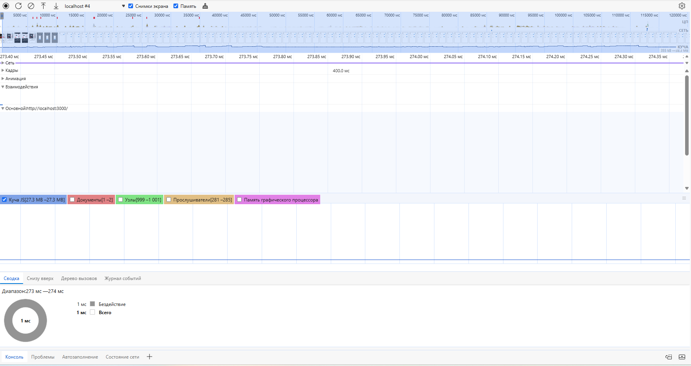
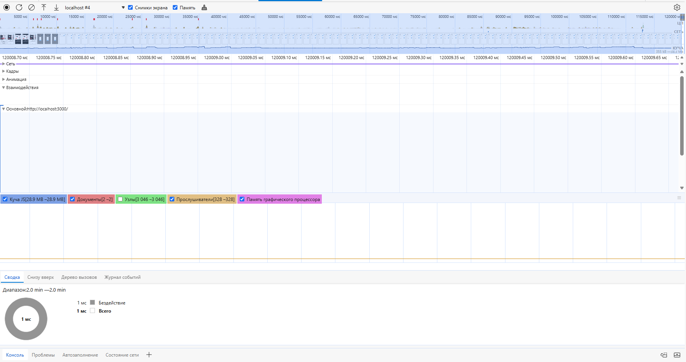
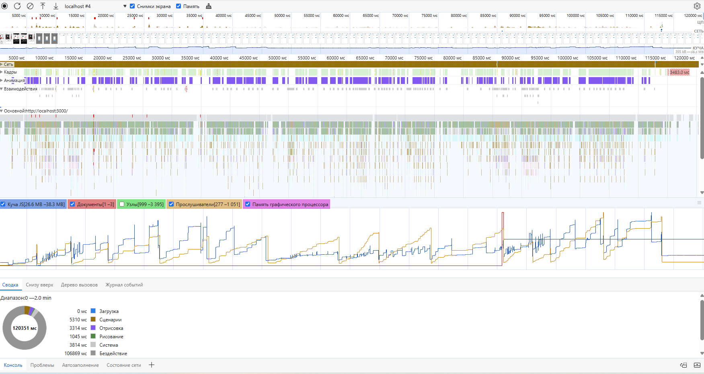

## Утечки памяти

### Интсрументы:

Для анализа использовался браузер Edge, вкладка “Performance”, с опцией просмотра временной шкалы памяти.

### Анализ:

Время тестирования составило 2 минуты.

Анализ Garbage Collector («сборщика мусора») проводился следующим образом: были выбраны две контрольные точки — начало и конец теста, и произведен замер выделенной памяти в каждой контрольной точке после “сборки мусора”.

Показатели памяти:

Начальная точка - 27.3 МБ

Конечная точка - 28.9 МБ

Максимальное использование памяти в момент использования составило 38.3 МБ

### Резутьтат:

Прирост выделенной памяти составил 1.6 МБ.

Увеличение потребления памяти на 1.6 МБ за 3 минуты может быть связано с нормальным функционированием приложения. Например, приложение может загружать новые данные или создавать новые объекты, что естественно приводит к росту потребления памяти.

Ввиду положительного результата дальнейшие тесты, более узко направленного действия, по поиску утечек памяти не проводились.

Однако, если в редких случаях вы заметите какие-либо проблемы с производительностью, сообщите нам, и мы проведем дальнейшее расследование.
